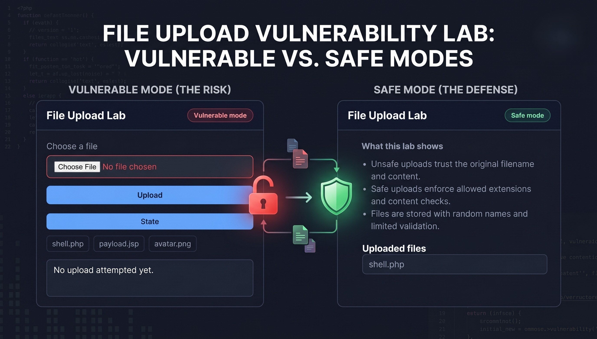
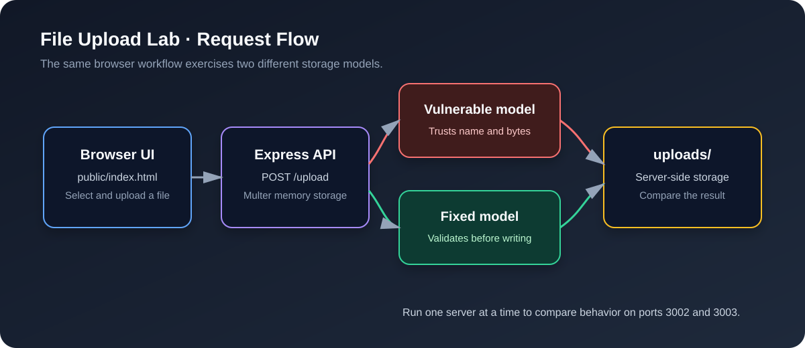
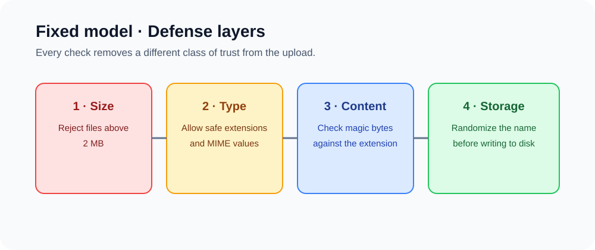

# File Upload Security Lab

<p align="center">
  
</p>



An intentionally vulnerable Node.js and Express lab for comparing unsafe file upload handling with a hardened implementation. Run the same browser workflow against both servers and observe how filename trust, content validation, and storage strategy change the result.

> **Safety:** This project is for local, isolated security education. Do not expose the vulnerable server to a network or use it with real files or data.

## What You Will Learn

- Why trusting an uploaded filename can create path and code-execution risk.
- Why extension checks and client-provided MIME types are not enough on their own.
- How magic-byte checks, size limits, and randomized storage names add defense in depth.
- How to compare a vulnerable implementation with a safer baseline in a controlled lab.



## Quick Start

Requirements: Node.js 18 or newer and npm.

```bash
npm install
```

Start the intentionally vulnerable server on port `3002`:

```bash
npm run vulnerable
```

Start the fixed server on port `3003` in a separate terminal:

```bash
npm run fixed
```

Open either URL in a browser:

- Vulnerable mode: <http://localhost:3002>
- Fixed mode: <http://localhost:3003>

Stop each server with `Ctrl+C`. The two processes share the local `uploads/` directory, so clear test artifacts between experiments when needed.

## Compare the Two Modes

| Behavior | Vulnerable mode | Fixed mode |
| --- | --- | --- |
| File size | Multer limit: 8 MB | 2 MB application limit |
| Extension | Accepted as supplied | `.png`, `.jpg`, `.jpeg`, `.gif`, `.webp` only |
| MIME type | Not validated | Compared with the allowlist |
| File content | Not inspected | Magic bytes checked against the extension |
| Stored name | Original filename | Timestamp plus UUID and safe extension |
| Main lesson | User input reaches disk directly | Multiple checks happen before storage |

The browser UI includes sample filenames for demonstrating why a name such as `shell.php` or `payload.jsp` should never be treated as harmless input. Use only inert lab files while testing.

## API Surface

| Method | Route | Purpose |
| --- | --- | --- |
| `GET` | `/mode` | Returns `vulnerable` or `fixed` |
| `POST` | `/upload` | Accepts a multipart field named `uploadFile` |
| `GET` | `/files` | Lists files currently in `uploads/` |

Example request:

```bash
curl -F "uploadFile=@sample.png" http://localhost:3003/upload
```

Successful responses include the active mode, original filename, and server-side storage name. Rejected files return an HTTP `400` response with the validation reason.

## Project Structure

```text
.
├── app.js                         # Shared Express application factory
├── server-vulnerable.js           # Lab server on port 3002
├── server-fixed.js                # Hardened server on port 3003
├── controllers/
│   ├── mode-controller.js         # Reports the active mode
│   └── upload-controller.js       # HTTP upload and listing behavior
├── models/
│   ├── vulnerable-upload.js       # Writes the original filename
│   └── fixed-upload.js            # Validates and randomizes storage
├── routes/upload-routes.js        # `/mode`, `/upload`, and `/files`
├── public/index.html              # Browser test interface
├── uploads/                       # Local lab output directory
└── docs/images/                   # README diagrams
```

## Where the Vulnerability Lives

The vulnerable model builds a destination path from `file.originalname` and writes the uploaded bytes without checking the file type. That creates a dangerous trust boundary: a user-controlled name and content reach server-side storage unchanged.

The fixed model applies checks before writing:

1. Require a file buffer and enforce a 2 MB limit.
2. Allow only known image extensions and MIME types.
3. Compare file signatures with the expected format.
4. Generate a random storage name instead of reusing user input.

These checks improve the lab implementation, but production systems should also store uploads outside the web root when possible, prevent executable files from running in upload directories, authorize downloads, scan content where appropriate, and set safe response headers such as `X-Content-Type-Options: nosniff`.

## Suggested Exercises

- Upload the same inert file to both ports and compare the JSON responses.
- Rename an image with an unsafe extension and observe the different outcomes.
- Change the filename and MIME type independently to see why layered validation matters.
- Inspect `uploads/` after each test and compare original versus randomized names.
- Add a download endpoint that serves files with authorization and safe content-disposition headers.

## Limitations

This is a deliberately small teaching project, not a complete production upload service. It does not provide authentication, malware scanning, persistent metadata, rate limiting, or a protected download endpoint. The vulnerable mode is intentionally unsafe by design.

## License

Use this lab for learning, testing, and secure-development demonstrations in environments you control.
